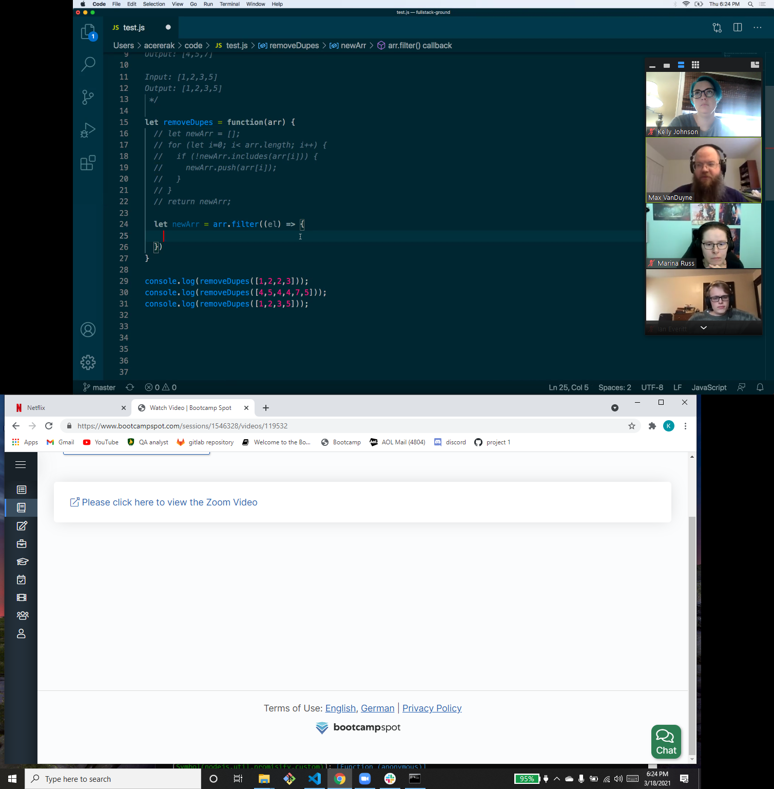

# Professional README Generator 
   
  ===========================================
    
  ## Description 
      This is a command-line application to dynamically generate quick README markdown files for open source projects.  
  ## Table of Contents 
  - [Installation](#installation)
  - [Usage](#usage)
  - [Contributions](#contributions)
  - [Tests](#tests)
  - [Questions](#questions)
  - [License](#license)
  ## Installation 
      Install Inquirer package using npm i inquirer --save in the command line.
  ## Usage 
      Invoke node index.js while in the directory with the repository for this app.

View this [video](https://drive.google.com/file/d/1AgsgmhXtREremi7oiT917MNhXSrM4PHB/view) as an example. 

  ## Contributions 
This was created by:
* kellyjohnson364: [https://github.com/kellyjohnson364](https://github.com/kellyjohnson364)
            
            
            
Please feel free to contribute to this project.
           

## Questions 
If you have questions or feedback, please contact kellyjohnson364 at [https://github.com/kellyjohnson364](https://github.com/kellyjohnson364) or via email at kj3641402@gmail.com.

## License
This project is licensed under The Unlicense.
For more info click [The Unlicense](./assets/licenses/theunlicense.md).
