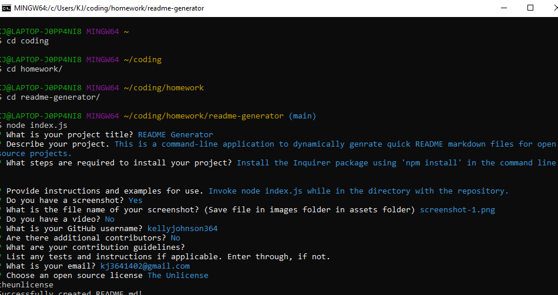

# readme generator 
   
  ===========================================
    
  ## Description 
   really cool project   
  ## Table of Contents 
  - [Installation](#installation)
  - [Usage](#usage)
  - [Contributions](#contributions)
  - [Tests](#tests)
  - [Questions](#questions)
  - [License](#license)
  ## Installation 
   install stuff
  ## Usage 
   stuff

  ## Contributions 
  This was created by:
   * kj364: [https://github.com/kj364](https://github.com/kj364)
   
   
   
Feel free to contribute to this project.
Please adhere to the [Contributor Covenant Code of Conduct](./assets/licenses/contributor-covenant.md)       
   
  ## Questions 
   If you have questions or feedback, please contact via kj364 at [https://github.com/kj364](https://github.com/kj364) or via email at kj3641402@gmail.com.
## License
This project is licensed under MIT License.
For more info click [MIT License](./assets/licenses/mitlicense.md).